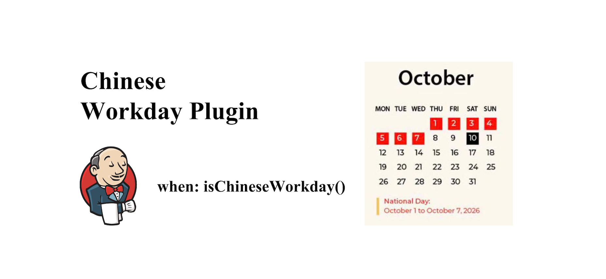

# Chinese Workday Plugin

[](https://github.com/jenkinsci/chinese-workday-plugin/releases)
[](https://plugins.jenkins.io/chinese-workday)
[](https://github.com/jenkinsci/chinese-workday-plugin/actions/workflows/jenkins-security-scan.yml)
[](LICENSE.md)

[中文说明](README.md)

## Overview

Chinese Workday Plugin lets Jenkins follow Chinese statutory holidays and make-up workdays instead of relying on plain weekday/weekend rules. Use it when a Pipeline stage, scheduled job, or future-date check should respect the China holiday calendar.

At a glance:

- bundled calendars for `2020` through `2026`
- Pipeline steps: `isChineseWorkday(...)`, `isChineseHoliday(...)`, and `chineseWorkdaySupportedYears()`
- Jenkins system configuration for adding or overriding year-specific calendars
- optional file-based overrides still supported for compatibility

## Common use cases

- run release or deploy stages only on Chinese workdays
- skip scheduled jobs on Chinese holidays or adjusted non-workdays
- add a temporary next-year calendar before a newer plugin release is installed

## Installation

### Option 1: Install from the Jenkins Plugin Center

1. Open `Manage Jenkins -> Plugins`
2. Search for `Chinese Workday`
3. Install the plugin and restart Jenkins if prompted

### Option 2: Manually upload an `hpi` package

Build the plugin locally:

```bash
mvn package
```

Then upload the generated `.hpi` from `target/` in Jenkins, for example `target/chinese-workday.hpi`:

1. Open `Manage Jenkins -> Plugins`
2. Open `Advanced settings`
3. In `Deploy Plugin`, choose the `.hpi` file
4. Upload the plugin and restart Jenkins if prompted

## Quick start

Run a release stage only on a Chinese workday:

```groovy
pipeline {
    agent any
    stages {
        stage('Build') {
            steps {
                echo 'Build runs every day.'
            }
        }
        stage('Release') {
            when {
                expression {
                    isChineseWorkday()
                }
            }
            steps {
                echo 'Release runs only on a Chinese workday.'
            }
        }
    }
}
```

## Missing next-year data?

- unsupported years fail explicitly instead of silently falling back to weekend-only logic
- use `chineseWorkdaySupportedYears()` before checking a future date
- add a temporary year in `Manage Jenkins -> System -> Chinese Workday`
- starting in December, Jenkins administrators see a reminder if next year is still unavailable

## Behavior summary

- default time zone: `Asia/Shanghai`
- data precedence: bundled resources < external files < Jenkins system configuration
- configured years override bundled data for the same year

## Usage

### Pipeline

Choose the step by intent:

- `isChineseWorkday(...)`: `true` for a Chinese workday
- `isChineseHoliday(...)`: `true` for a Chinese holiday or adjusted non-workday
- `chineseWorkdaySupportedYears()`: available bundled and configured years

Notes:

- all Pipeline steps use `Asia/Shanghai`
- `date` is optional; when omitted, the step checks today
- unsupported years fail explicitly

#### Check today

```groovy
def todayIsWorkday = isChineseWorkday()
echo "todayIsWorkday=${todayIsWorkday}"

if (!todayIsWorkday) {
    echo 'Skip release actions on a Chinese non-workday.'
}
```

#### Check a specific date

```groovy
def holiday = isChineseHoliday(date: '2025-10-03')
echo "holiday=${holiday}"
```

#### Gate a stage with `when`

```groovy
pipeline {
    agent any
    stages {
        stage('Release') {
            when {
                expression {
                    isChineseWorkday()
                }
            }
            steps {
                echo 'Release runs only on a Chinese workday.'
            }
        }
    }
}
```

#### Reuse one decision across later stages

```groovy
pipeline {
    agent any
    stages {
        stage('Prepare') {
            steps {
                script {
                    env.RUN_RELEASE = isChineseWorkday() ? 'true' : 'false'
                }
            }
        }
        stage('Release') {
            when {
                expression {
                    env.RUN_RELEASE == 'true'
                }
            }
            steps {
                echo 'Release is enabled for today.'
            }
        }
    }
}
```

#### Check future-year support before using a custom date

```groovy
def targetYear = 2027
def years = chineseWorkdaySupportedYears()

if (!years.contains(targetYear)) {
    error "Chinese workday calendar for ${targetYear} is not configured yet."
}

echo "isWorkday=${isChineseWorkday(date: '2027-10-02')}"
```

### Freestyle

Add the build step `Chinese Workday Check`.

- `Date`: optional, ISO `yyyy-MM-dd`; blank means today in `Asia/Shanghai`
- `Fail build on non-workday`: fail the step so later Freestyle steps do not run

Example build log:

```text
Chinese Workday check
Date: 2025-10-03
Time zone: Asia/Shanghai
Workday: false
Holiday: true
```

## System configuration

Administrators can add or override calendars in `Manage Jenkins -> System -> Chinese Workday`.

Quick steps:

1. Open `Manage Jenkins -> System`
2. Find `Chinese Workday` and click `Add calendar`
3. Fill in the year, holidays, and make-up workdays, then save

Fields:

- `Year`: target calendar year, for example `2027`
- `Holidays`: ISO dates or date ranges using `..`
- `Make-up workdays`: dates that should be treated as workdays even on weekends

Rules:

- use ISO format `yyyy-MM-dd`
- use `..` for ranges, for example `2027-10-01..2027-10-07`
- separate entries with commas or new lines
- every date in a year entry must belong to that year
- a date cannot appear in both `Holidays` and `Make-up workdays`

Example:

```text
Year: 2027
Holidays:
2027-01-01
2027-02-10..2027-02-16
2027-04-05
2027-10-01..2027-10-07

Make-up workdays:
2027-02-07
2027-02-20
2027-09-26
```

After saving, new builds use the updated calendar. For compatibility, the plugin still reads optional file overrides from `$JENKINS_HOME/chinese-workday/calendars/`, but Jenkins system configuration has higher priority.

Starting in December, Jenkins administrators also see a management warning if next year is still unavailable. The warning links to `Manage Jenkins -> System -> Chinese Workday` so you can add a temporary override or upgrade the plugin if a newer release already bundles that year.

## Troubleshooting

- future year missing: add a temporary calendar in `Manage Jenkins -> System -> Chinese Workday`
- weekend returned as a workday: some Chinese make-up workdays fall on weekends
- system configuration overrides bundled data by design: `bundled < external file < system config`

## Holiday data maintenance

Bundled holiday data should be updated through a documented review process rather than ad hoc file edits. For the source policy, yearly update checklist, and validation flow, see `docs/calendar-maintenance.md`.

## Development and contributing

Contributions are welcome. Prefer small, incremental changes that keep behavior stable and well-tested.

Useful repository docs:

- `CONTRIBUTING.md`
- `docs/development.md`
- `docs/architecture.md`
- `docs/calendar-maintenance.md`

Jenkins community guidelines:

- https://github.com/jenkinsci/.github/blob/master/CONTRIBUTING.md

## License

Licensed under MIT. See `LICENSE.md`.
